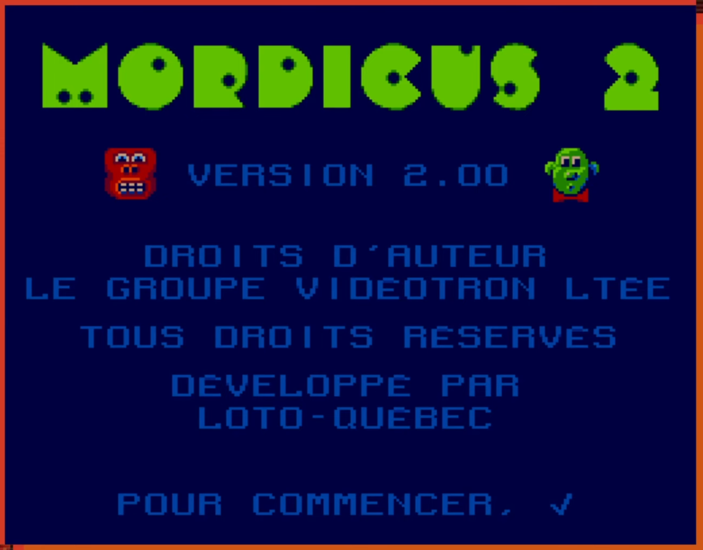
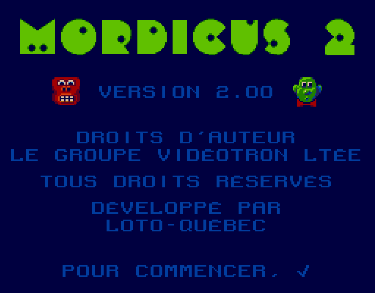
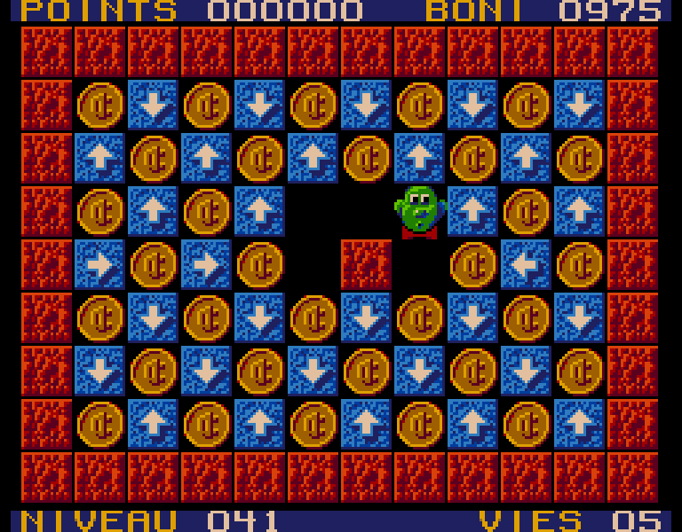

# 🐵 mordicus 🍌

Reproduction en JavaScript du jeu Mordicus 2 sur [Vidéoway](<https://lostmediawiki.com/Videoway_(lost_Canadian_cable-box_games;_1990-2006)>).

Ce projet est une reproduction la plus fidèle possible du jeu original Mordicus 2.
Je tiens à remercier et à féliciter Maxime de la chaîne YouTube [Des Jeux pis d'la Bière](https://youtube.com/@jeuxbiere?feature=shared) pour ses recherches sur ce jeu, aujourd'hui introuvable dans sa version originale, qui ont permis de déduire les règles du jeu ainsi que de retrouver plusieurs niveaux originaux.

Les 240 niveaux du jeu "frère" [Mozaic](https://youtu.be/YygmFM3qP8w?feature=shared) que Maxime a [répertoriés et archivés](https://archive.org/details/mozaic-240-levels/001.png) sont inclus dans ce projet. Les premiers niveaux connus de Mordicus 2 sont présents dans le jeu Mozaic aux positions [148](https://archive.org/details/mozaic-240-levels/148.png), [142](https://archive.org/details/mozaic-240-levels/142.png) et [143](https://archive.org/details/mozaic-240-levels/143.png). Dans ce projet, ces 3 niveaux sont déplacés au début alors tous les autres sont demeurés dans leur ordre relatif excepté le niveau 89 qui a été tiré à l'emplacement 89 (pas le choix!).

Les niveaux ont été copiés à l'aide d'un éditeur de niveau, ce fut un processus long et abrutissant. Il est probable que j'ai fait des erreurs. Veuillez m'en informer en créant une "Issue" ou en proposant une "Pull request" avec la correction.

## Installation

Le projet fonctionne à l'aide de Vite qui nécessite l'installation de [Node.js](https://nodejs.org/). Il a comme dépendances TypeScript et rxjs.

```sh
npm install
npm run dev
```

## Contrôles

Mordicus se dirige avec les flèches du clavier,
Appuyez sur Espace ou Enter pour le caractère "✓",
Faites Escape à tout moment pour abandonner et recommencer le niveau.

Vous perdez 5 points "Boni" par mouvement, ces points sont additionnés au "Score" lorsque le niveau est réussi. Les meilleurs pointages pour chacun des niveaux sont conservés en localStorage, ils persistent donc après avoir fermé la page.
Le code du dernier niveau atteint sera automatiquement entré dans le champ de mot de passe, mais il ne sera pas sauvegardé si vous fermez la page. Vous devrez le noter, comme dans le temps!

## Captures

Écran titre du jeu original:

<p align="center"></img></p>

Captures de la reproduction:

<p align="center"></img></p>

<p align="center"></img></p>

<p align="center"></img></p>
