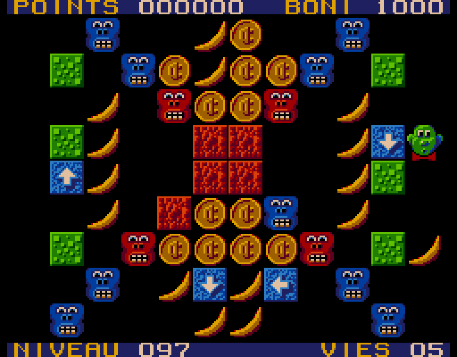

# 🐵 mordicus 🍌

Reproduction en JavaScript du jeu Mordicus 2 sur [Vidéoway](<https://lostmediawiki.com/Videoway_(lost_Canadian_cable-box_games;_1990-2006)>).

Ce projet est une reproduction la plus fidèle possible du jeu original Mordicus 2.
Je tiens à remercier et à féliciter Maxime de la chaîne YouTube [Des Jeux pis d'la Bière](https://youtube.com/@jeuxbiere?feature=shared) pour ses recherches sur ce jeu des années 1990 qui ont permis de déduire et comprendre les règles du jeu ainsi que de retrouver plusieurs niveaux originaux.

Les 240 niveaux du jeu "frère" [Mozaic](https://youtu.be/YygmFM3qP8w?feature=shared) que Maxime a [répertoriés et archivés](https://archive.org/details/mozaic-240-levels/001.png) sont inclus dans ce projet. Les premiers niveaux connus de Mordicus 2 sont présents dans le jeu Mozaic aux positions [148](https://archive.org/details/mozaic-240-levels/148.png), [142](https://archive.org/details/mozaic-240-levels/142.png) et [143](https://archive.org/details/mozaic-240-levels/143.png). Dans ce projet, ces 3 niveaux sont déplacés au début du jeu alors tous les autres sont demeurés dans leur ordre relatif excepté le niveau 89 qui a été tiré à l'emplacement 89 (pas le choix!).

Les niveaux ont été copiés à l'aide d'un éditeur de niveau, ce fut un processus long et abrutissant. Il est probable que j'ai fait des erreurs. Veuillez m'en informer en créant une "Issue" ou en proposant une merge request avec la correction.

## Installation

Le projet fonctionne à l'aide de Vite qui nécessite l'installation de [Node.js](https://nodejs.org/). Il a comme dépendances TypeScript et rxjs.

```sh
npm install
npm run dev
```

<p style="text-align: center"></img></p>

<p style="text-align: center"></img></p>

<p style="text-align: center"></img></p>
